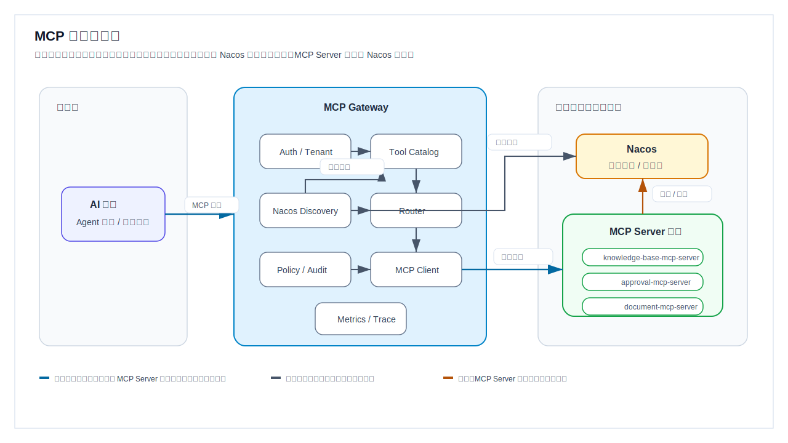
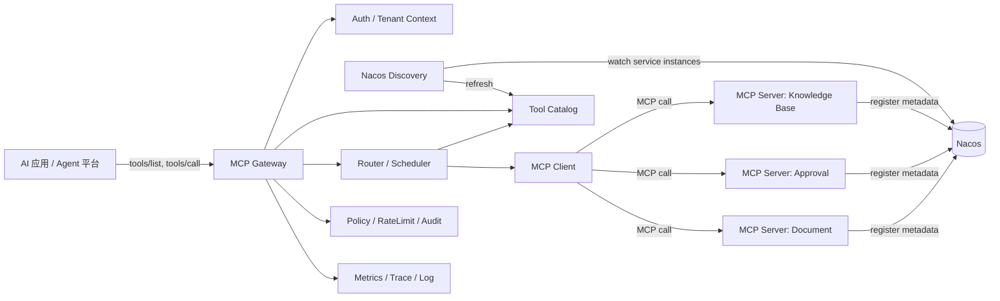
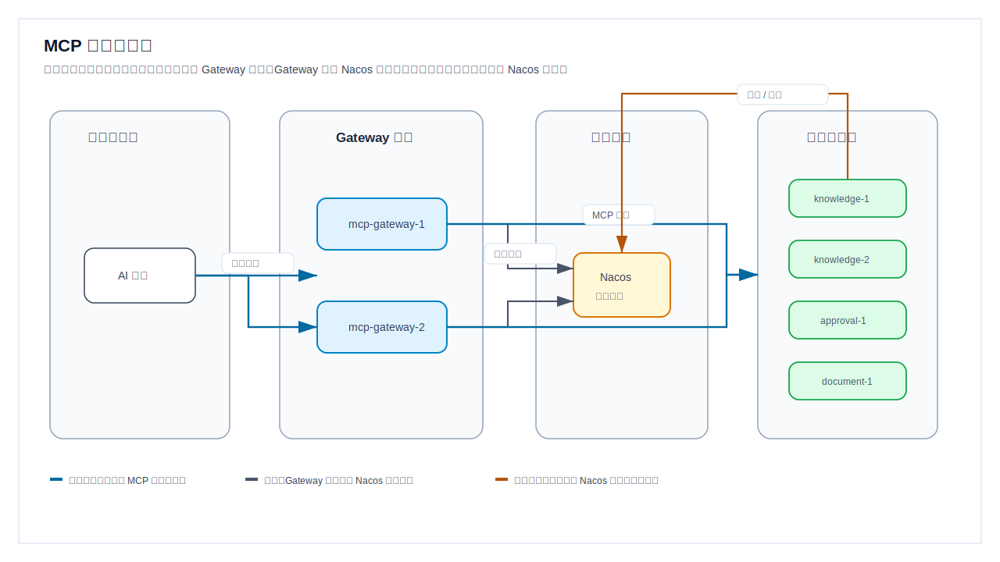
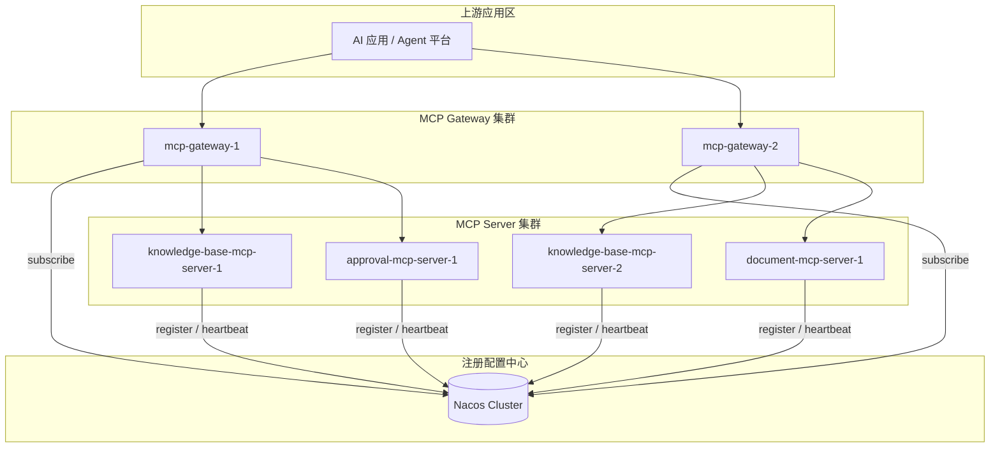
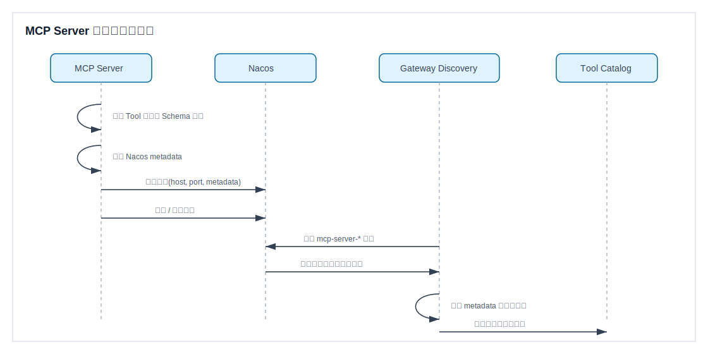
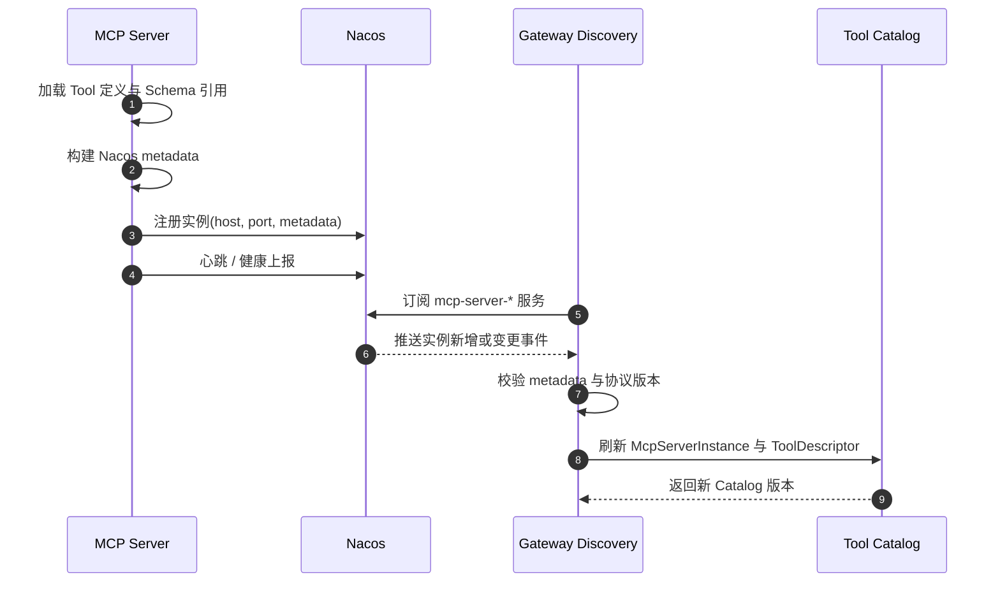
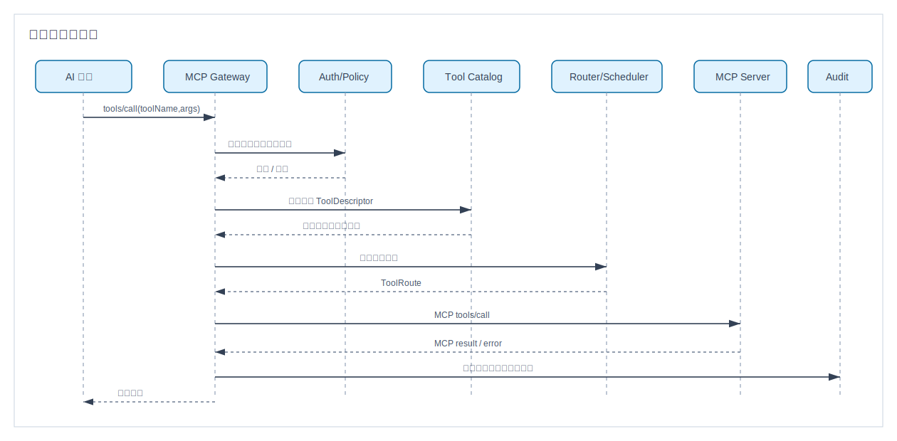
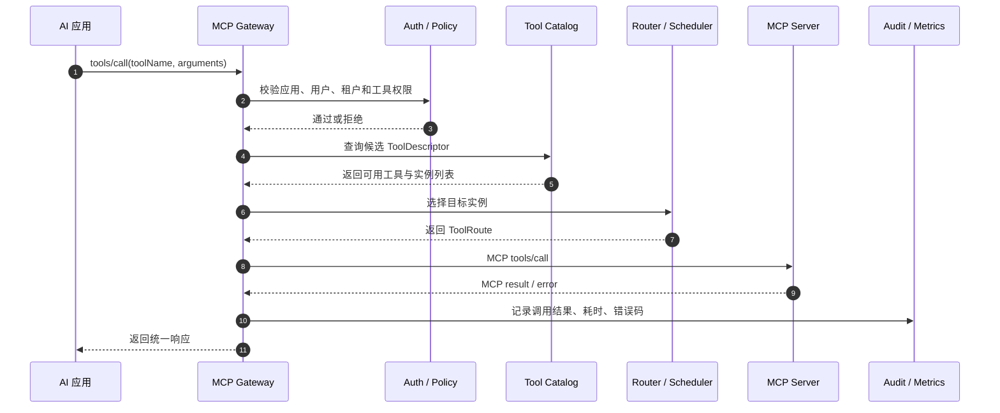
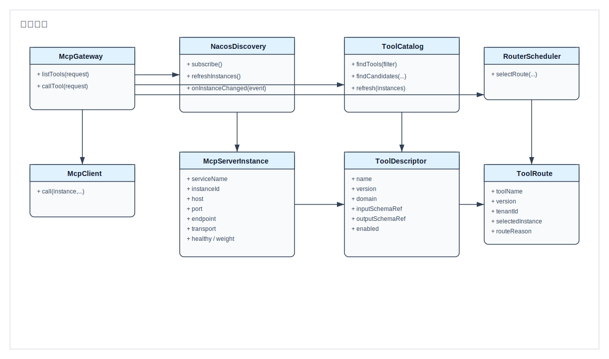
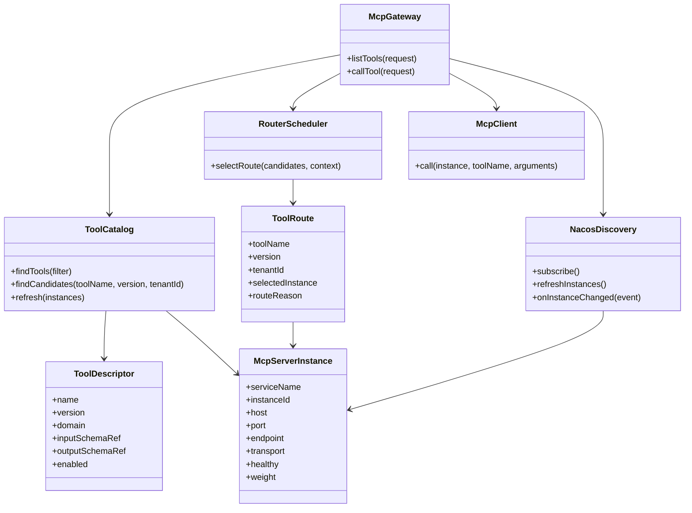

# MCP 网关 Nacos 服务发现设计

## 背景与目标

企业 AI 升级项目需要建设统一工具层，将知识库、审批、文档等能力封装为 MCP Tool。为避免工具服务静态配置、发布耦合和治理分散，本方案设计 MCP Server 自动注册到 Nacos，由 MCP 网关动态发现、聚合工具目录并统一调度。

设计目标：

- MCP Server 自注册、自描述、自健康上报。
- MCP 网关动态发现工具服务，无需重启即可感知上下线。
- 对上游 AI 应用暴露稳定的工具发现和调用入口。
- 对下游 MCP Server 提供统一治理，包括鉴权、限流、审计、观测、熔断和灰度。

## 总体架构

```text
AI 应用 / Agent 平台
        |
        | MCP Tool List / Call
        v
MCP Gateway
  |-- 接入鉴权与租户上下文
  |-- Tool Catalog 聚合缓存
  |-- Nacos Discovery 监听
  |-- Router / Scheduler 调度
  |-- Policy / RateLimit / Audit
  |-- Metrics / Trace / Log
        |
        | MCP over HTTP/SSE 或 Streamable HTTP
        v
MCP Server 集群
  |-- knowledge-base-mcp-server
  |-- approval-mcp-server
  |-- document-mcp-server
        |
        | 自动注册实例与元数据
        v
Nacos
```

核心思路是把 Nacos 作为服务实例和工具元数据的来源，MCP 网关内部维护一份可查询、可路由的 Tool Catalog。MCP Server 只负责声明自己提供哪些工具和端点；MCP 网关负责把这些声明转换为上游可用的统一工具目录。

## UML 视图

当前文档同时提供 SVG 图片版和 Mermaid 源码版。若当前 Markdown 查看器不支持 Mermaid，请直接查看下面的 SVG 图片。

| 图 | SVG 文件 |
| --- | --- |
| 组件图 | [component-diagram.svg](uml/component-diagram.svg) |
| 部署图 | [deployment-diagram.svg](uml/deployment-diagram.svg) |
| MCP Server 注册发现时序图 | [registration-sequence.svg](uml/registration-sequence.svg) |
| 工具调用时序图 | [tool-call-sequence.svg](uml/tool-call-sequence.svg) |
| 核心类图 | [class-diagram.svg](uml/class-diagram.svg) |

### 组件图



组件图说明：

- `AI 应用 / Agent 平台` 只依赖 MCP 网关暴露的统一入口，不直接感知后端 MCP Server 实例。
- `Auth / Tenant` 负责应用身份、用户身份与租户上下文解析，是所有工具调用进入调度前的前置校验。
- `Nacos Discovery` 订阅 Nacos 中的 MCP Server 实例变化，并把实例、协议端点、工具元数据转换为网关内部对象。
- `Tool Catalog` 聚合所有可用工具，支持按工具名、版本、领域、标签、租户范围进行查询。
- `Router / Scheduler` 根据目录、权限、灰度、健康状态和权重选择目标实例。
- `MCP Client` 负责向下游 MCP Server 集群发起真实 `tools/call` 调用；组件图只画到集群边界，具体选择哪个实例由 `Router / Scheduler` 在运行时决策，细节放到时序图和调度说明中表达。
- `Policy / Audit` 和 `Metrics / Trace` 分别承载限流、审计、指标和链路追踪等治理能力。
- 图中蓝色表示 MCP 工具调用链路，只画到 MCP Server 集群；灰色表示服务发现与目录刷新链路；橙色表示 MCP Server 集群注册实例与心跳。组件图不展开每个 Server 实例的调用分支，避免把“可选路由”误解为“同时调用”。



### 部署图



部署图说明：

- `上游应用区` 只访问 `Gateway 集群`，不直接访问 Nacos 或工具服务区。
- `Gateway 集群` 可多实例部署，每个实例独立订阅 Nacos，保持本地 Tool Catalog。
- `注册中心` 只表达 Nacos 的服务发现职责，不承载业务调用。
- `工具服务区` 包含多个 MCP Server 实例，部署图只展示实例分布；具体工具路由由网关调度完成。
- 图中蓝色表示业务请求和 MCP 调用主链路，灰色表示 Gateway 订阅 Nacos，橙色表示工具服务实例注册和心跳。



### MCP Server 注册发现时序图





### 工具调用时序图





### 核心类图





## 模块设计

### MCP Server 注册模块

每个 MCP Server 启动时向 Nacos 注册服务实例。建议每类工具服务使用独立 serviceName，例如：

- `mcp-server-knowledge-base`
- `mcp-server-approval`
- `mcp-server-document`

注册内容分两层：

- 实例基础信息：IP、端口、权重、集群、命名空间、分组、健康状态。
- MCP 元数据：协议版本、传输方式、工具清单、工具版本、能力标签、租户范围、鉴权类型、灰度标识。

实例下线时应主动注销；异常退出时依赖 Nacos 心跳或健康检查剔除。

### Nacos Discovery 模块

网关启动后订阅指定 namespace/group 下的 MCP Server 服务列表，并监听实例变化。Discovery 模块负责：

- 拉取全量服务与实例元数据。
- 监听实例新增、删除、健康状态变化和元数据变化。
- 将 Nacos 原始实例转换为内部 `McpServerInstance`。
- 通知 Tool Catalog 进行增量刷新。

为防止 Nacos 短暂抖动影响调用，网关应保留本地缓存，并设置缓存 TTL、最后可用版本和降级策略。

### Tool Catalog 模块

Tool Catalog 是网关对上游暴露工具发现能力的核心。它将多个 MCP Server 的工具元数据聚合成统一目录：

- 按 `toolName` 建立索引。
- 按 `domain`、`tags`、`version`、`tenantScope` 建立过滤条件。
- 支持同名工具多版本或多实例。
- 标记工具可用状态、灰度状态和推荐实例。

当多个 MCP Server 注册同名工具时，默认按 `toolName + version + domain` 去重；如果仍冲突，则进入冲突状态，不对外暴露为默认可调用工具，避免误路由。

### Router / Scheduler 模块

调度模块负责把一次工具调用路由到合适的 MCP Server 实例。推荐调度顺序：

1. 根据 `toolName` 查找候选工具。
2. 根据租户、权限、版本、标签和灰度规则过滤。
3. 根据健康状态、权重、负载和熔断状态选择实例。
4. 通过 MCP Client 调用目标 MCP Server。
5. 记录调用结果，并反馈给熔断、指标和审计模块。

默认策略可采用加权轮询；后续可扩展最小延迟、最少请求数或基于成本的调度。

### MCP 协议适配模块

网关对上游提供 MCP 兼容入口，至少包含：

- `tools/list`：返回聚合后的工具目录。
- `tools/call`：接收工具调用并转发到目标 MCP Server。

下游连接方式建议优先支持 MCP Streamable HTTP；如现有服务使用 SSE，也可通过适配层兼容。网关不应篡改工具业务参数，只补充必要的上下文，例如租户、用户、TraceId、调用来源和权限声明。

### 安全与治理模块

网关作为统一入口，应集中处理：

- 鉴权：验证上游应用身份、用户身份、租户上下文。
- 授权：校验调用方是否允许访问目标 Tool。
- 限流：按应用、租户、用户、Tool 维度限流。
- 审计：记录调用方、工具、参数摘要、结果状态、耗时和错误码。
- 脱敏：日志中避免落明文敏感参数。
- 熔断降级：实例连续失败后临时摘除，保留可配置恢复窗口。

## Nacos 元数据约定

建议 Nacos metadata 使用 JSON 字符串字段承载 MCP 元数据，核心字段如下：

```json
{
  "mcpProtocolVersion": "2025-03-26",
  "transport": "streamable-http",
  "endpoint": "/mcp",
  "domain": "knowledge-base",
  "serverVersion": "1.0.0",
  "tenantMode": "shared",
  "authType": "gateway-token",
  "tools": [
    {
      "name": "knowledge.search",
      "version": "1.0.0",
      "description": "Search enterprise knowledge base",
      "tags": ["knowledge", "search"],
      "inputSchemaRef": "nacos://mcp-schemas/knowledge.search/1.0.0",
      "outputSchemaRef": "nacos://mcp-schemas/knowledge.search/1.0.0",
      "enabled": true
    }
  ],
  "gray": {
    "enabled": false,
    "labels": []
  }
}
```

设计建议：

- 小规模元数据可直接放在 Nacos instance metadata。
- 大型 schema 不建议直接塞入实例 metadata，可使用 `schemaRef` 指向 Nacos Config、对象存储或独立元数据服务。
- 工具名采用领域前缀，例如 `knowledge.search`、`approval.submit`、`document.generate`，降低冲突概率。
- metadata 增加 `metadataVersion` 后可支持兼容升级。

## 核心流程

### MCP Server 启动注册

```text
MCP Server 启动
  -> 加载本地 Tool 定义
  -> 生成 Nacos 注册 metadata
  -> 注册 Nacos 实例
  -> 开始心跳或健康上报
  -> 对外提供 /mcp 与 /health
```

如果注册失败，MCP Server 可以继续启动但标记为不可发现；生产环境建议注册失败超过阈值后启动失败，避免服务已运行但网关不可见。

### 网关发现刷新

```text
MCP Gateway 启动
  -> 订阅 mcp-server-* 服务
  -> 拉取 Nacos 全量实例
  -> 校验 metadata
  -> 构建 Tool Catalog
  -> 监听 Nacos 变更
  -> 增量刷新工具目录
```

刷新过程应使用版本化快照，先构建新 Catalog，再原子替换，避免查询时读到半更新状态。

### 工具调用

```text
AI 应用发起 tools/call
  -> 网关鉴权与租户解析
  -> Tool Catalog 查询候选工具
  -> Policy 过滤
  -> Scheduler 选择实例
  -> MCP Client 调用下游 MCP Server
  -> 统一错误码映射与响应封装
  -> 记录指标、Trace 和审计
```

## 关键数据对象

```text
McpServerInstance
- serviceName
- instanceId
- host
- port
- endpoint
- protocolVersion
- transport
- weight
- healthy
- metadataVersion
- tags
- tools[]

ToolDescriptor
- name
- version
- domain
- description
- inputSchemaRef
- outputSchemaRef
- tenantMode
- authPolicy
- enabled
- providerInstances[]

ToolRoute
- toolName
- version
- tenantId
- selectedInstance
- routeReason
- policySnapshot
```

## 高可用与异常处理

- Nacos 不可用：网关继续使用最后一次成功加载的 Catalog，并输出告警；超过 TTL 后可按配置进入只读发现或拒绝新工具调用。
- MCP Server 不健康：Discovery 标记不可用，Scheduler 不再选择该实例。
- 工具元数据非法：跳过该实例的非法工具，保留实例其他合法工具，并记录告警。
- 同名工具冲突：进入冲突态，需通过版本、领域或显式优先级解决。
- 下游调用超时：按 Tool 维度配置超时时间，失败计入熔断统计。
- 网关多实例部署：每个网关实例独立订阅 Nacos；Tool Catalog 构建逻辑保持确定性。

## 配置建议

```yaml
mcpGateway:
  nacos:
    namespace: my-cloud-ai
    group: MCP_SERVER_GROUP
    servicePattern: mcp-server-*
    watchEnabled: true
    cacheTtlSeconds: 300
  catalog:
    conflictPolicy: mark-conflict
    schemaLoadMode: lazy
  routing:
    defaultStrategy: weighted-round-robin
    healthRequired: true
  governance:
    defaultTimeoutMs: 30000
    circuitBreakerEnabled: true
    auditEnabled: true
```

## 兼容与演进

- 第一阶段：完成 MCP Server 注册、网关发现、工具目录聚合和基础调用。
- 第二阶段：补齐鉴权、限流、审计、Trace、熔断和灰度。
- 第三阶段：引入独立 Tool Metadata 服务，支持更复杂的 schema、工具市场和权限编排。
- 第四阶段：支持多注册中心、多环境迁移和跨地域容灾。

## 风险与取舍

- 将工具 metadata 放入 Nacos 简单直接，但不适合承载大型 schema；因此保留 `schemaRef`。
- 网关统一调度降低上游复杂度，但会成为关键链路；需要多实例部署和缓存降级。
- MCP 协议仍在演进，协议版本需要显式注册并在网关侧做兼容策略。
- 同名工具冲突在多团队接入时概率较高，必须在命名规范和冲突策略上提前约束。

## 待确认项

- MCP Server 的主要技术栈与 MCP SDK 版本。
- 当前 Nacos 环境的 namespace、group、鉴权方式和网络连通策略。
- 上游 AI 应用希望直接使用 MCP 协议，还是通过现有 HTTP API 间接调用。
- 工具级权限模型是否按租户、角色、用户或应用维度控制。
- 知识库、审批、文档三个首批 Tool 的名称、参数 schema 和响应 schema。
